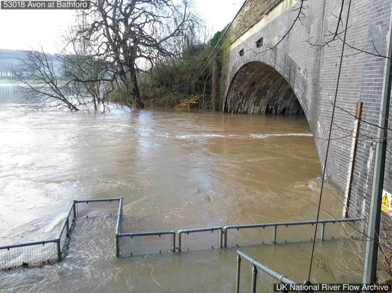

# Gallery

***

## 💡Project Portfolio Inspiration Board

| River Flow Project | |
| --- | --- |
|  | |
| [https://github.com/OU-Weather-and-Climate-Club/River-Flow-Project](https://github.com/OU-Weather-and-Climate-Club/River-Flow-Project) | |
| An exploratory data analysis on river flow and rainfall at Bathford gauging station on the River Avon | |

***

## 📊 Club Visualization Challenge

### 2024: [Greenhouse Gas Removals - 9 ways to remove CO2 from the air](https://github.com/OU-Weather-and-Climate-Club/GGR-Data-Visualisation-Challenge)

***

